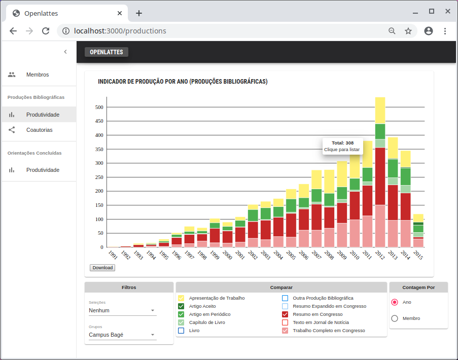
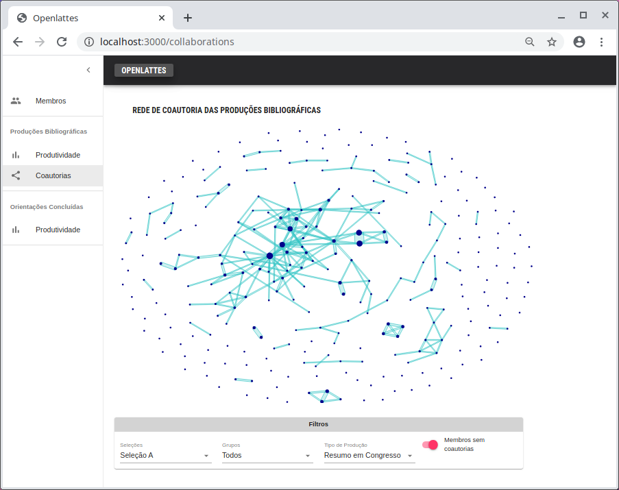

# Openlattes
Web application to visualize scientific production indicators and coauthorship networks. The data comes from the Lattes curriculum using [this extraction tool](https://github.com/openlattes/extract).

Stack: GraphQL, MongoDB, React, Material-UI and Semiotic.




### Environment setup
```
$ yarn
$ cp .env-template .env
```
Update `.env` with required information.

### Running for development

```
$ yarn start
```

### Running for production
```
$ yarn run build
$ yarn run now-start
```

### Admin client development
```
$ yarn run startadmindev
```

### Admin build

Warning: there's no authentication so only use it locally for settings like updating the groups stored in the DB.

```
$ yarn run buildadmin
$ yarn run startadmin
```

### License

Openlattes: web application to visualize bibliometric indicators of the
Lattes Platform.

Copyright (C) 2018, 2019  Murilo Dutra

This program is free software: you can redistribute it and/or modify
it under the terms of the GNU General Public License as published by
the Free Software Foundation, either version 3 of the License, or
(at your option) any later version.

This program is distributed in the hope that it will be useful,
but WITHOUT ANY WARRANTY; without even the implied warranty of
MERCHANTABILITY or FITNESS FOR A PARTICULAR PURPOSE.  See the
GNU General Public License for more details.

You should have received a copy of the GNU General Public License
along with this program.  If not, see <http://www.gnu.org/licenses/>.
